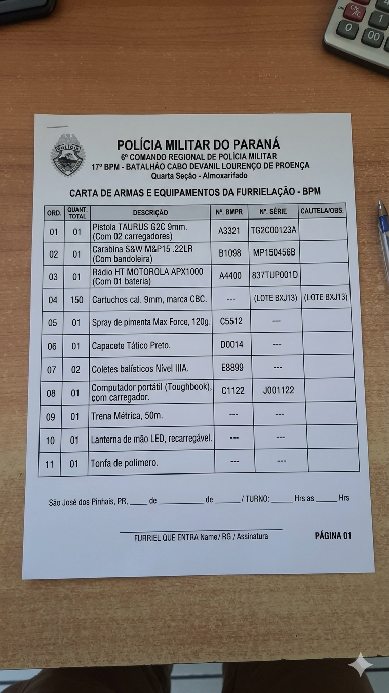
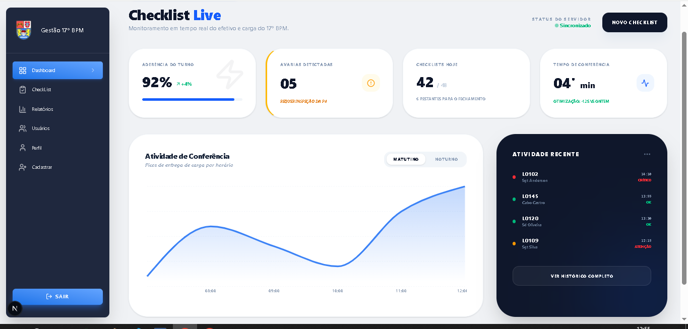
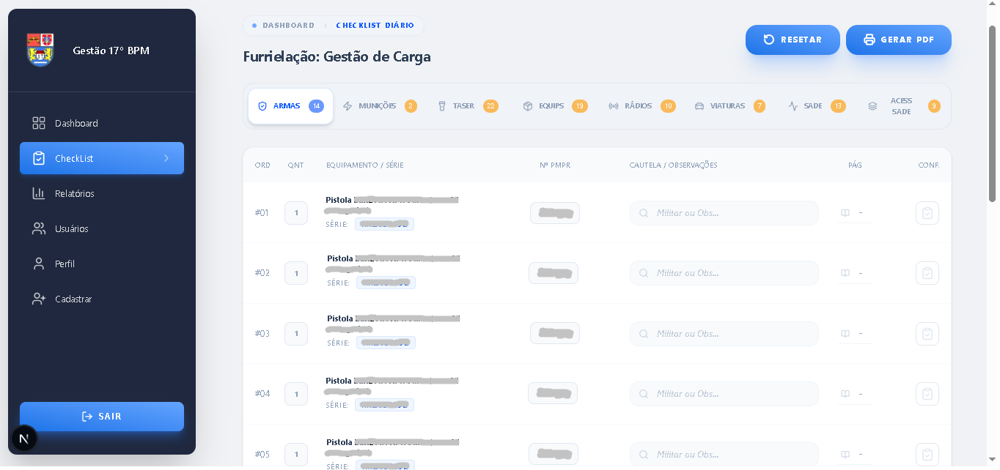
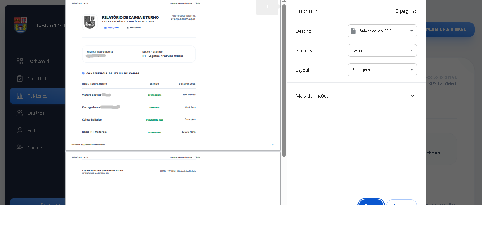
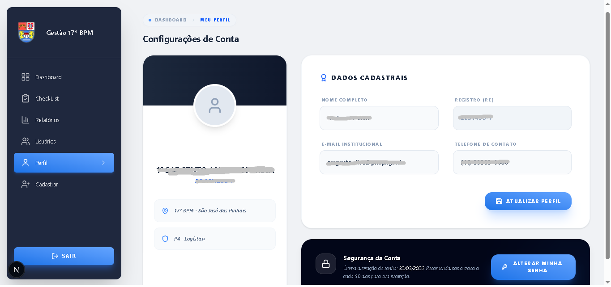
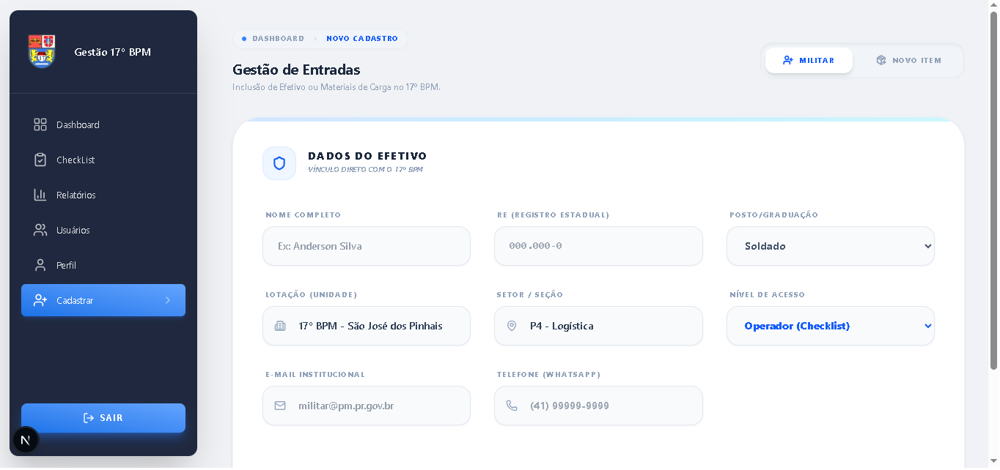
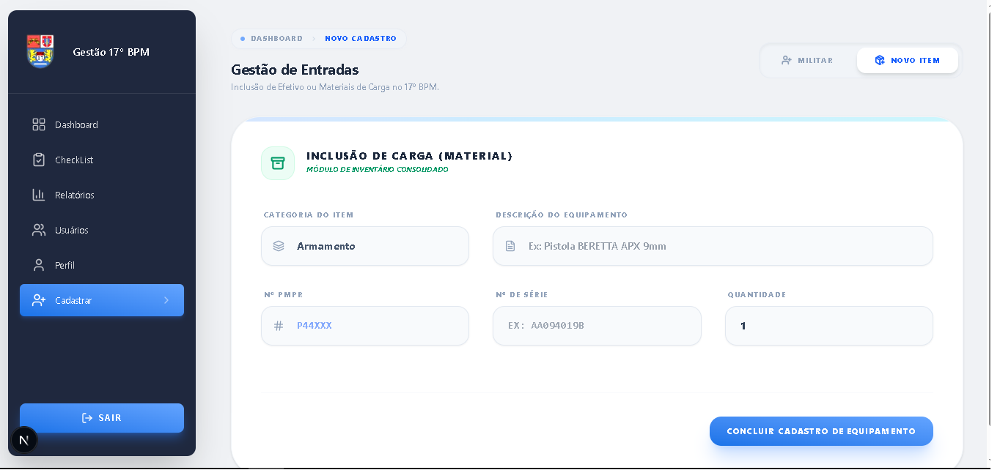

# 🛡️ Sistema de Checklist Digital - 17º BPM

  
  
  
  

  <strong>Otimização de fluxos de conferência e logística da Furrielação do 17º Batalhão de Polícia Militar.</strong>

---

## 📖 Sobre o Projeto: Do Papel para Performance Digital

O **Sistema de Checklist Digital** foi idealizado para sanar um gargalo operacional na **Furrielação do 17º BPM**. Atualmente, a conferência de itens é realizada através de formulários físicos impressos, o que gera um fluxo burocrático e oneroso.

### 📉 O Processo Atual

* **Consumo de Papel:** São impressas 02 cópias por turno (Diurno e Noturno) para conferência de carga.
* **Logística Física:** Após o preenchimento manual, as cópias devem ser entregues fisicamente ao almoxarifado.
* **Gestão de Arquivo:** O armazenamento físico dificulta a consulta rápida de históricos de avarias ou responsabilidades.

### 🚀 A Transformação Digital
Este projeto substitui o checklist físico por uma interface digital responsiva. O Furriel realiza a conferência em tempo real e, ao concluir, os dados são disponibilizados instantaneamente para o almoxarifado, eliminando o papel e agilizando a conferência de carga.

---

## 🏗️ Arquitetura e Design Sênior

O sistema adota uma metodologia **Frontend-First** baseada em uma robusta **Arquitetura de Componentes Reutilizáveis**, garantindo escalabilidade e rigor visual.

### 🧩 Destaques Técnicos
* **Dashboard Analítico:** Painel com indicadores de prontidão operacional e alertas de avarias.
* **Checklist Mobile-First:** Interface otimizada para web, tablets e smartphones, facilitando a conferência no pátio ou reserva de armas.
* **Relatórios Inteligentes:** Conversão automática de checklists finalizados em documentos oficiais.

---

## 📸 Demonstração da Transição Operacional

### 🚩 Processo (Baseado em Papel/Planilha)

  
   
  <em style="font-size: 11px; color: #586069;">Representação da dependência de fluxos manuais e descentralizados (imagem meramente ilustrativa).</em>

### 🚀 Nova Interface Digital

<table width="100%" border="0" cellspacing="0" cellpadding="0">
  <tr>
    <td width="50%" valign="top" style="padding: 10px;">
      

        

        
Autenticação segura para militares cadastrados.

        
      

    </td>
    <td width="50%" valign="top" style="padding: 10px;">
      

        

        
Interface de auto-cadastro para novos operadores.

        
      

    </td>
  </tr>

  <tr>
    <td width="50%" valign="top" style="padding: 10px;">
      

        

        
Solicitação de recuperação via e-mail institucional.

        
      

    </td>
    <td width="50%" valign="top" style="padding: 10px;">
      

        

        
Feedback de confirmação e orientações de segurança.

        
      

    </td>
  </tr>

  <tr>
    <td width="50%" valign="top" style="padding: 10px;">
      

        

        
Finalização do fluxo com criação de nova credencial.

        
      

    </td>
    <td width="50%" valign="top" style="padding: 10px;">
      

        

        
Visão geral com indicadores de prontidão operacional e alertas (StatCards).

        
      

    </td>
  </tr>

  <tr>
    <td width="50%" valign="top" style="padding: 10px;">
      

        

        
Interface de conferência rápida de itens.

        
      

    </td>
    <td width="50%" valign="top" style="padding: 10px;">
      

        

        
Painel de exportação de dados para PDF e Excel.

        
      

    </td>
  </tr>

  <tr>
      <td width="50%" valign="top" style="padding: 10px;">
      

        

        
Documento timbrado pronto para arquivo oficial PDF ou Impressão.

        
      

    </td>
   <td width="50%" valign="top" style="padding: 10px;">
      

        

        
Listagem de militares com PermissionBadges.

        
      

    </td>
  </tr>

  <tr>
     <td width="50%" valign="top" style="padding: 10px;">
      

        

        
Componente Modal unificado para inserção de dados (Cadastrar Usuário).

        
      

    </td>
     <td width="50%" valign="top" style="padding: 10px;">
      

        

        
Interface Perfil do Usuário.

        
      

    </td>
  </tr>

  <tr>
    <td width="50%" valign="top" style="padding: 10px;">
      

        

        
Interface para Cadastro de Novo Usuário

        
      

    </td>
    <td width="50%" valign="top" style="padding: 10px;">
      

        

        
Interface para Cadastro de Novo Equipamento

        
      

    </td>
    <td width="50%" valign="top" style="padding: 10px;">
      </td>
  </tr>
</table>

---

## 🛠️ Stack Tecnológica

| Ferramenta | Aplicação |
| :--- | :--- |
| **Next.js 15** | Framework Estrutural (App Router) |
| **React 19** | Biblioteca de Interface |
| **Tailwind CSS** | Design System e Estilização Sênior |
| **Lucide React** | Iconografia Vetorial |

---

## 👤 Desenvolvedor

**Hildo Costa** - *Software Developer*

  
  

